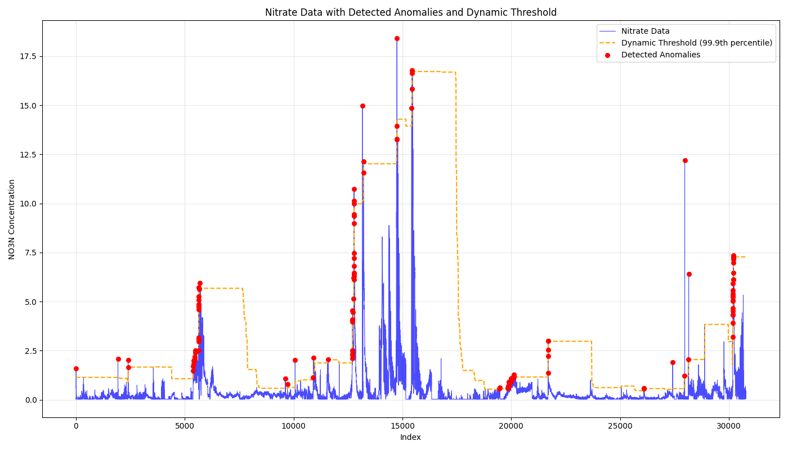

# Anomaly Detection Results

## 1. Chosen Parameters
- **Window Size (W)**: 2000
- **Quantile (q)**: 99.9

### Rationale for Parameters
**Window Size (W = 2000)**: This size provides a good balance, being large enough to establish an accurate baseline of normal behavior, while still being adaptive to changes. Large windows can reduce adaptability, may be less adaptable, and small ones might be over-sensitive.

**Quantile (q = 99.9)**: There are 77 true anomalies in the dataset out of 30790 total points. Knowing this, a high threshold is required. The 99.9th quantile ensures high accuracy, minimizing false alarms. If approaching this with no prior knowledge, a lower quantile (98-99.5%) may be more appropriate to prevent missing potential anomalies, while still being high enough to be selective of extreme values.

**Note**: While knowing there are exactly 77 anomalies out of 30,790 points might suggest a 99.75% threshold and a large window (50% or more) of the data to achieve 77 anomalies found. This current approach maintains generalizability and flexibility to future scenarios.

## 2. Performance Summary

### Confusion Matrix
| Metric | Count |
|--------|-------|
| **True Positives (TP)** | 77 |
| **False Positives (FP)** | 51 |
| **False Negatives (FN)** | 0 |
| **True Negatives (TN)** | 30,662 |
| **Predicted Anomalies** | 128 |
| **Known True Anomalies** | 77 |

### Accuracy Metrics
- **Normal Event Detection Accuracy**: 99.83% (TN/N)
- **Anomaly Event Detection Accuracy**: 100.00% (TP/P)